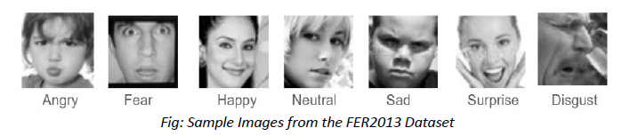
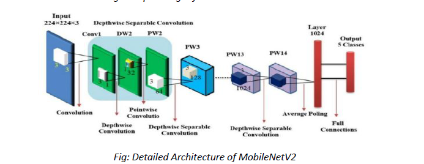
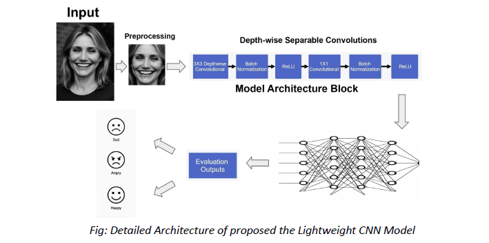
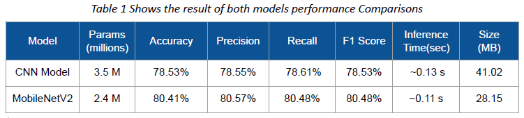
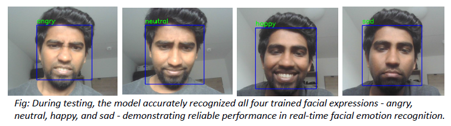

# Lightweight MobileNetV2-Based CNN for Facial Expression Recognition

## Overview
This project focuses on developing a lightweight Convolutional Neural Network (CNN) for facial expression recognition, optimized for real-time applications on mobile and edge devices[cite: 3]. By leveraging the MobileNetV2 architecture, the model improves accuracy and efficiency, particularly when working with diverse and low-quality datasets.

## Methodology
* **Dataset:** The FER2013 dataset was used, specifically focusing on four emotion classes: Angry, Happy, Sad, and Neutral.
* **Preprocessing:** Images were resized to 224x224 (RGB) and normalized to a [0, 1] range.
* **Data Augmentation:** Techniques such as shifting, rotating, flipping, and shearing were applied to improve model robustness.
* **Optimization Techniques:** The training process utilized Early Stopping, Model Checkpointing, Label smoothing, Learning Rate Scheduling, and Fine-Tuning.

## Datset

  

## Model Architecture
The core of the optimized model is based on **MobileNetV2**, which utilizes depthwise separable convolutions[cite: 3]. This approach applies one filter per input channel (depthwise convolution) and then mixes them using 1x1 convolutions (pointwise convolution), significantly reducing computational cost. 

  
  

## Performance and Results
After applying identical preprocessing and optimization settings, the MobileNetV2 model (using an alpha of 0.75 and 224x224 resolution) outperformed a custom baseline CNN (48x48 resolution) across all key metrics. 

  
  

*Note: The MobileNetV2 model achieved a lower GPU latency of 65.5 ms compared to the CNN's 105.39 ms, demonstrating its suitability for embedded systems.*

## Output

  

## Future Work
Future iterations of this project will explore other lightweight architectures, such as EfficientNet or ShuffleNet, to evaluate potential performance gains.

## Authors & Acknowledgements
* **Md Iqbal Ahmed**.
* Department of Graphical Systems, Brandenburg University of Technology Cottbus - Senftenberg, Cottbus, Germany.
